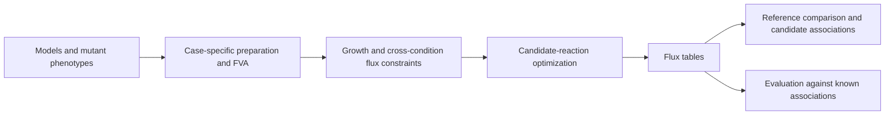

# GEM-PROSPECT

## Overview

GEM-PROSPECT uses mutant growth phenotypes and genome-scale metabolic models to identify candidate gene–reaction associations. For a candidate reaction, it links fluxes across experimental conditions and asks how much flux remains compatible with the mutant phenotype. Reduced flux can support a candidate association; it is not experimental confirmation of protein function.

The repository contains two implementations: a **Chlamydomonas reinhardtii** workflow using protein-constrained models and measured phenotype ratios, and an **Escherichia coli** benchmark using iML1515 and binary gene-essentiality labels. The MATLAB optimization routines are reusable within their documented assumptions. The supplied condition definitions, filters, and parameter choices belong to these case studies. There is currently no command-line interface that automatically adapts arbitrary organisms or condition sets.

Start with the installation and small example below. See [input formats](docs/input_formats.md), [parameters](docs/parameters.md), [reproduction instructions](docs/reproducing_manuscript.md), and [applying to a new dataset](docs/applying_to_new_dataset.md).

## Workflow

1. Load condition-specific metabolic models and prepare mutant phenotype measurements.
2. Use flux variability analysis (FVA) to select candidate metabolic reactions.
3. For the C. reinhardtii case, convert log2 phenotype measurements to linear ratios and build the eight condition models.
4. Constrain biomass fluxes using these ratios and a minimum fraction of condition-specific optimal growth.
5. For each candidate reaction, impose equal reaction flux across the active conditions, minimize the sum of flux variables, then maximize the target flux at that minimum. Split reversible reactions are evaluated using net flux in both directions.
6. Compare predicted fluxes with reference flux sampling to identify candidate associations and evaluate known associations.

The E. coli implementation instead bounds growth according to essentiality labels and maximizes target flux directly; it does **not** use the C. reinhardtii ratio constraints or flux-sum minimization.



## Repository structure

```text
GEM-PROSPECT/
├── README.md
├── Code/
│   ├── matlab/             # Case-study scripts
│   │   └── function/       # GEM_PROSPECT*, FVA, condition helpers
│   ├── python/             # Phenotype filtering, E. coli evaluation, annotations
│   └── R/                  # Phenotype aggregation, associations, manuscript figures
├── Data/
│   ├── pciCre1355/          # Three C. reinhardtii SBML models
│   ├── Ecoli/              # iML1515 and essentiality data
│   └── Reactions/          # Reaction ID/index and known-GPR tables
├── Results/                # Supplied reference results and generated outputs
├── docs/                   # Data contracts, parameters, adaptation, reproducibility
├── scripts/                # Setup, input checks, case-study wrappers
└── examples/               # Small MATLAB run and phenotype header template
```

[Script inventory](docs/repository_map.md) describes the entry points, preprocessing, evaluation, and optional annotation scripts. Use `setup_gem_prospect` to add the two active MATLAB directories to your path.

## Requirements

| Component | Needed for |
|---|---|
| MATLAB | Modeling and optimization |
| Parallel Computing Toolbox | Existing `parfor`, `parpool`, and `parfevalOnAll` calls; case scripts request 20 workers |
| COBRA Toolbox, including working SBML import | `readCbModel`, `optimizeCbModel`, `findExcRxns`, GPR helpers; `gpSampler` for sampling |
| Gurobi optimizer, license, and MATLAB interface | Direct `gurobi(...)` calls and COBRA optimization |
| Python, NumPy, pandas, openpyxl, SciPy | Mutant-library profile filtering (pandas Spearman correlations use SciPy) |
| Python, COBRApy, pandas, NumPy, matplotlib | E. coli evaluation |
| R, dplyr, stringr | Phenotype aggregation |
| R, dplyr, tidyr, purrr | Candidate association export |
| R, ggplot2, patchwork, scales, ggbeeswarm, gridExtra, svglite | Main figures, in addition to dplyr and tidyr; svglite writes SVG output |

`scripts/check_inputs.py` uses only the Python standard library. MATLAB, Parallel Computing Toolbox, COBRA and Gurobi are sufficient for the quick start. Python preprocessing/evaluation and R postprocessing are separate stages; install their packages when running those stages. Optional annotation scripts have separate requirements listed in [the inventory](docs/repository_map.md).

## Installation

1. Clone the project in a terminal:

   ```bash
   git clone https://github.com/YunliEricHsieh/GEM-PROSPECT.git
   cd GEM-PROSPECT
   ```

2. Install MATLAB with Parallel Computing Toolbox. Install and license Gurobi, then configure its MATLAB interface following the [official setup instructions](https://docs.gurobi.com/projects/optimizer/en/current/reference/matlab/setup.html). Run `gurobi_setup` from the installed Gurobi MATLAB directory.

3. Install the COBRA Toolbox using its [official installation instructions](https://opencobra.github.io/cobratoolbox/stable/installation.html). In MATLAB, initialize it from its installation directory using `initCobraToolbox`. Ensure SBML models load successfully. Return to the GEM-PROSPECT repository root and run:

   ```matlab
   addpath(fullfile(pwd, 'scripts'));
   setup_gem_prospect();
   which readCbModel
   which gurobi
   ```

   Setup checks required functions and adds only the active project MATLAB paths. It does not install or initialize external tools. Direct Gurobi calls are part of the implementation; changing only COBRA's solver to another solver is insufficient.

4. Install Python packages for phenotype preprocessing or E. coli evaluation:

   ```bash
   python3 -m venv .venv
   source .venv/bin/activate
   python -m pip install numpy pandas scipy openpyxl cobra matplotlib
   ```

   On Windows activate the environment with `.venv\Scripts\activate`.

5. For R association export, run `install.packages(c("dplyr", "tidyr", "purrr"))`. For phenotype aggregation add `stringr`. To run association export, aggregation and the main figures, install:

   ```r
   install.packages(c("dplyr", "tidyr", "purrr", "stringr", "ggplot2",
                      "patchwork", "scales", "ggbeeswarm", "gridExtra", "svglite"))
   ```

## Quick start

From the repository root, check the small example's inputs:

```bash
python3 scripts/check_inputs.py --workflow quick-start
```

After initializing COBRA and Gurobi, run in MATLAB:

```matlab
addpath(fullfile(pwd, 'scripts'));
setup_gem_prospect();
addpath(fullfile(pwd, 'examples'));
demo = quick_start();
disp(demo);
```

This example uses the supplied phenotype row for `A0A2K3E4Q7`, the three supplied models, the case-study condition helpers, and two candidate reaction IDs. It calls the irreversible and reversible optimization functions and writes two rows to `Results/examples/quick_start.csv`, with columns `EnzymeID`, `RxnID`, `Direction`, and `MaxFlux`. Inspect the returned table and solver messages. `NaN` requires investigating feasibility or solver status; a zero can represent a calculated flux or a reversible second-stage solve failure. See [example details](examples/README.md) and the failure-handling notes under Output.

## Input data

All case-study paths are relative to the repository root. Preserve the capitalization of `Code`, `Data`, and `Results`.

| Input | Meaning and format |
|---|---|
| `Data/pciCre1355/NDLadpraw_{Autotrophic,Mixotrophic,Heterotrophic}_Rep1.xml` | Supplied SBML protein-constrained models; import as COBRA model structs |
| `Data/Mutant_phenotypes_table_filtered_final.csv` | One gene per row; `GeneID`, `UniProtID`, eight used **log2 phenotype-ratio** columns, plus three currently unused measurements |
| `Data/GO_table_filtered.txt` | Tab-separated `UniProtID`, `GO_ID`, `GO_Name`, `GO_Aspect`; restricts the C. reinhardtii candidate enzyme set |
| `Results/FVA/*_FVA_10p.csv` | `RxnID`, `minFlux`, `maxFlux`; required by C. reinhardtii reaction selection |
| `Data/Reactions/*.csv` | Maps generated `RxnIndex` names to model `RxnID`; some tables include semicolon-separated `Enzymes` |
| `Results/flux_sampling/{auto,mixo,hetero}_sampling*.csv` | Reference `RxnIndex`, `RxnID`, `meanFlux`, `stdFlux`; used in downstream candidate calls |
| `Data/Ecoli/iML1515.mat` | MAT file containing the COBRA struct named `model` |
| `Data/Ecoli/iML1515.xml` | SBML model read by Python for E. coli evaluation |
| `Data/Ecoli/Ecoli_gene_essentiality.csv` | **Semicolon-separated** table; required fields `Gene_ID`, `Essentiality_0_1` (1 essential, 0 nonessential) |

For a full field contract, ratio orientation, units, missing values, source phenotype spreadsheet, mapping tables, examples, and ID conventions, read [input formats](docs/input_formats.md) before substituting data. The phenotype values in `Data/Mutant_phenotypes_table.xlsx` are taken directly from the original study's processed log2 abundance ratios. GEM-PROSPECT filters and aggregates these supplied values, then converts the selected comparisons to linear ratios for model constraints. Normalization from raw counts belongs to the original study and is not repeated here.

## Output

| Output | Interpretation |
|---|---|
| `Results/screens/Max_flux_screen_8.csv` | `EnzymeID` × irreversible `RxnIndex`; maximum flux after flux-sum minimization |
| `Results/screens/Max_flux_screen_8_Re.csv` | `EnzymeID` × forward `RxnIndex`; maximum absolute net flux for split reversible pairs |
| `Results/potential_gene_reaction_associations.csv` | `RxnIndex`, `RxnID`, `enzyme_candidates`; candidates shared across three reference comparisons |
| `Results/screens/Ecoli/max_flux_results_1e*.csv` | `RxnID`, `MaxFlux` for each tested τ |
| `Results/screens/Ecoli/CS/max_flux_results_1e*.csv` | Separate condition-specific control maxima for all 16 carbon sources |
| `Results/figures/*.svg`, `GEM_PERSPECT_accuracy_comparison.png` | Manuscript evaluation plots; the existing PNG filename retains its original spelling |

Fluxes follow model scaling (metabolic reaction fluxes conventionally mmol gDW⁻¹ h⁻¹; biomass is a specific growth rate). These tables are not probabilities or ranked confidence scores. Inference failure handling differs between functions: irreversible C. reinhardtii failures remain `NaN`; reversible second-stage failures and E. coli failures can become zero. Preserve this distinction when interpreting results. The R export flags `log10(abs(MaxFlux)/abs(meanFlux)) < -1`, a greater-than-tenfold decrease, and intersects candidates across Auto/Hetero/Mixo; it does not average those three reference fluxes first.

## Reproducing the manuscript

### Chlamydomonas reinhardtii analysis

For modeling from the supplied processed phenotype table:

```bash
python3 scripts/check_inputs.py --workflow chlamydomonas
```

In MATLAB after installation:

```matlab
addpath(fullfile(pwd, 'scripts'));
reproduce_chlamydomonas('all');
```

The wrapper runs FVA → reaction metadata → inference → reference sampling and **overwrites their named outputs**. Run it in a separate clone to retain the supplied reference results. To rerun inference using supplied FVA and sampling references, run `reproduce_chlamydomonas('prospect')` instead. To inspect supplied results without rerunning optimization, run the two R commands below directly.

Then, from the repository root:

```bash
Rscript scripts/reproduce_chlamydomonas.R associations
Rscript scripts/reproduce_chlamydomonas.R figures
```

These generate the candidate table and Figs. 2–3. The R wrapper uses the repository root and checks required packages before running. The source-profile preprocessing sequence and individual stages are described in [reproduction instructions](docs/reproducing_manuscript.md). Sampling uses `gpSampler` defaults without an explicit seed reset; rerunning it can change downstream candidate calls.

### Escherichia coli analysis

```bash
python3 scripts/check_inputs.py --workflow ecoli
```

In MATLAB after installation:

```matlab
addpath(fullfile(pwd, 'scripts'));
reproduce_ecoli('all');
```

Then, from the repository root:

```bash
python3 Code/python/Accuracy_Ecoli.py
```

The wrapper runs 16-condition FVA followed by the existing essentiality-based τ sweep and condition-specific controls. Evaluation writes the comparison PNG and displays a plot. Labels are used in constructing growth constraints as well as evaluation; this is recovery of known associations under the benchmark setup, not a held-out validation. See [reproduction instructions](docs/reproducing_manuscript.md) for exact settings and limitations.

## Applying the framework elsewhere

Read [applying to a new dataset](docs/applying_to_new_dataset.md). Changing organisms requires mapping condition and reaction IDs, checking model representation, choosing and recording dataset-specific parameters, and establishing an appropriate benchmark. The current ratio-based functions fix eight condition-pair slots; an arbitrary condition graph requires a reviewed code adaptation. Current constants are not universal defaults.

## License

GEM-PROSPECT source code and documentation are licensed under the [MIT License](LICENSE). Supplied models, phenotype datasets, and third-party tools retain their respective terms; the project license does not replace them.

## Citation

The manuscript describing GEM-PROSPECT is currently under peer review. Until publication, please acknowledge GEM-PROSPECT and include the [repository URL](https://github.com/YunliEricHsieh/GEM-PROSPECT) in your methods or software references. See [citation information](CITATION.md) for the manuscript title and authors. The formal paper citation will be added after publication.
